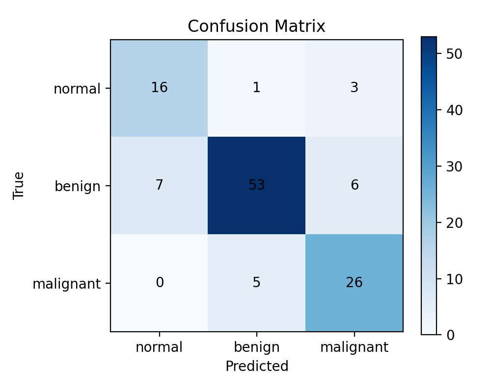
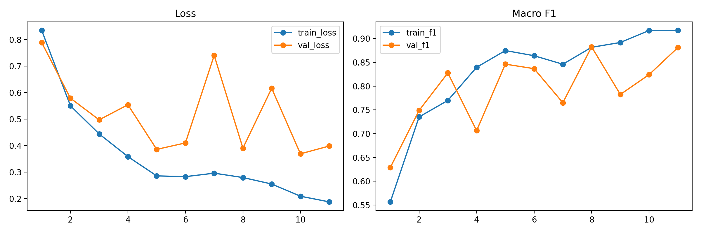
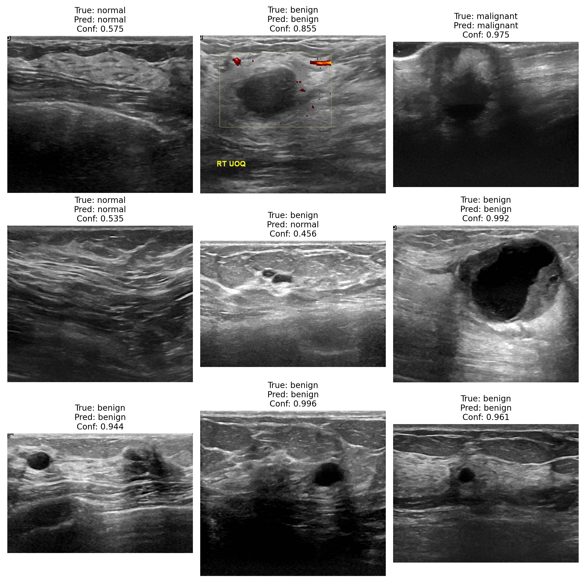
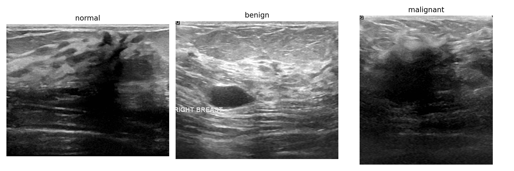

# Breast Ultrasound Image Classification on BUSI

A medical imaging classification project using the **BUSI (Breast Ultrasound Images)** dataset to classify ultrasound scans into **normal**, **benign**, and **malignant** categories.

This project was built as a **research prototype** for exploring AI in medical imaging, with a focus on reproducible training, clear evaluation, and honest reporting of limitations.

---

## Overview

Breast cancer is one of the most common cancers worldwide, and ultrasound imaging is often used as a non-invasive diagnostic tool. In this project, I trained a **pretrained ResNet18** model on the **BUSI dataset** to perform **3-class classification** of breast ultrasound images:

- **Normal**
- **Benign**
- **Malignant**

The pipeline includes:
- dataset parsing
- train/validation/test split
- augmentation and normalization
- class-balanced training
- evaluation with multiple metrics
- confusion matrix and qualitative predictions

---

## Dataset

This project uses the **BUSI (Breast Ultrasound Images Dataset)**.

### Class distribution
- **Benign:** 437 images
- **Malignant:** 210 images
- **Normal:** 133 images

### Total
- **780 images**

### Split
- **Train:** 546
- **Validation:** 117
- **Test:** 117

> Note: the BUSI dataset does not provide reliable patient identifiers in this version, so this project uses an **image-level split** rather than a patient-level split.

---

## Model

- **Architecture:** ResNet18
- **Initialization:** ImageNet pretrained
- **Task:** 3-class image classification
- **Input size:** 224 × 224
- **Loss:** Weighted Cross-Entropy Loss
- **Optimizer:** AdamW
- **Training:** early stopping based on validation macro F1

---

## Results

### Best validation result
- **Best Validation Macro F1:** **0.8825**

### Test set results
- **Accuracy:** **0.812**
- **Macro F1:** **0.793**
- **Macro One-vs-Rest ROC-AUC:** **0.944**
- **Test Loss:** **0.448**

### Per-class performance

| Class | Precision | Recall | F1 |
|------|----------:|-------:|---:|
| Normal | 0.696 | 0.800 | 0.744 |
| Benign | 0.898 | 0.803 | 0.848 |
| Malignant | 0.743 | 0.839 | 0.788 |

---

## Visual Results

### Confusion Matrix


### Training History


### Sample Predictions


### Dataset Samples


---

## Repository Structure

```text
busi-breast-ultrasound-classification/
│
├── README.md
├── busi_classification.ipynb
├── metrics_summary.json
├── history.csv
│
├── results/
   ├── confusion_matrix.png
   ├── history_plot.png
   ├── dataset_samples.png
   ├── sample_predictions.png

